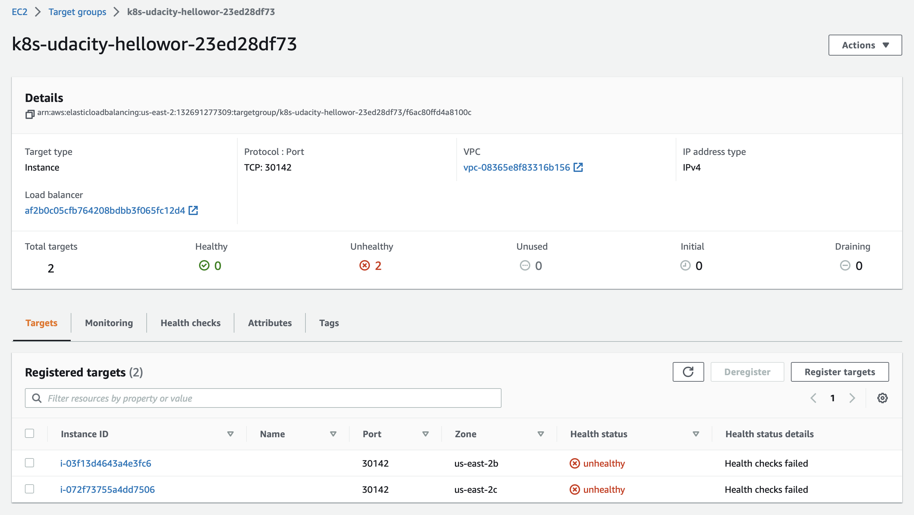
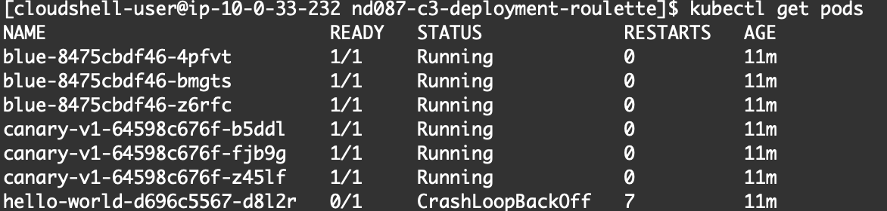
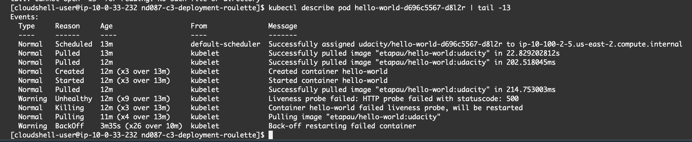
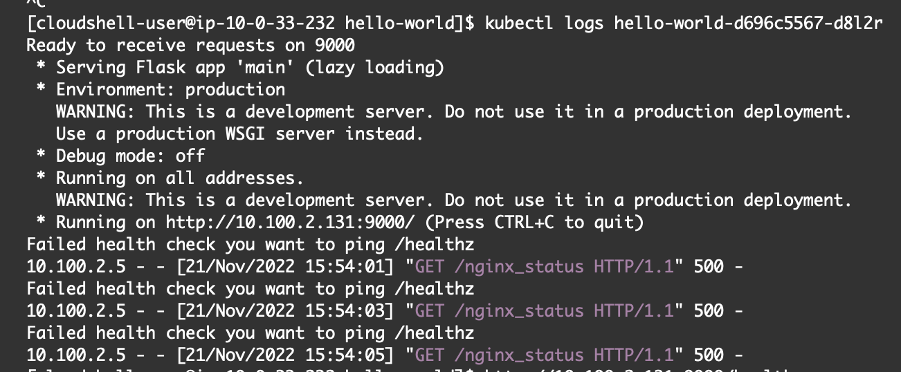
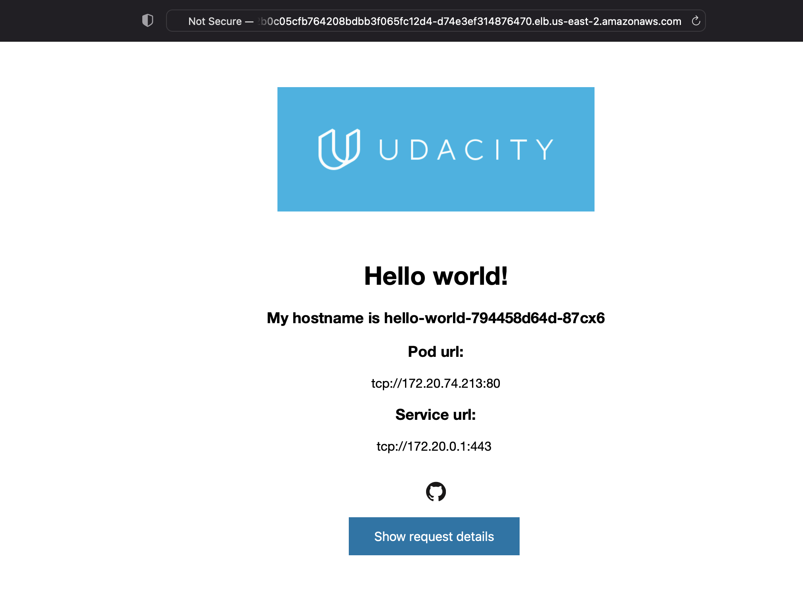
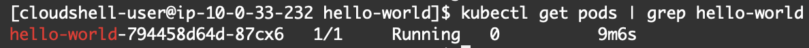
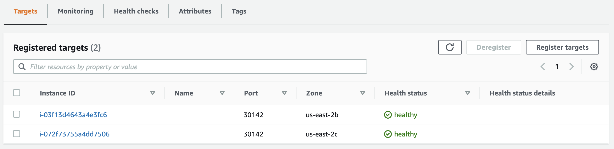
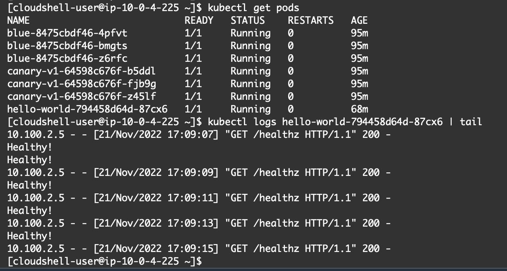

# Step 1: Debugging Steps for hello-world Application
1. Checked load balancer in AWS web console. No obvious issues, so proceeded to check load balancer targets, which were found to be unhealthy 

2. Checked pods and found a crashed hello-world pod 

3. Checked the pod events for the crashed pod using kubectl describe pod, and confirmed that liveness probe was failing 

*N.B. For the screenshot, the command was executed a second time and passed through the tail command so that both the relevant events and pod name were both visible.*

4. Inspected the logs for the crashed pod - these gave the strong hint that the `/healthz` endpoint should be being checked for the health check 

The liveness probe was amended accordingly in `hello.yml`

5. Following application of the amended YAML deployment, the endpoint became accessible 

6. Rechecking the pods showed everything to be running healthily 

7. Rechecking the load balancer targets showed that they were now also reporting as healthy 

8. Output from `kubectl logs <pod_name>` verified as returning `healthy!`

