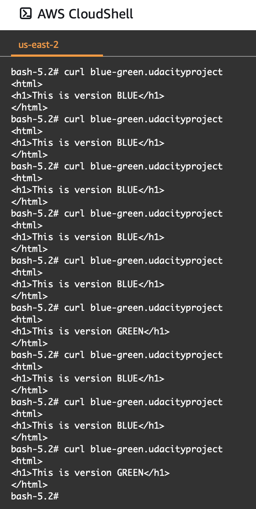
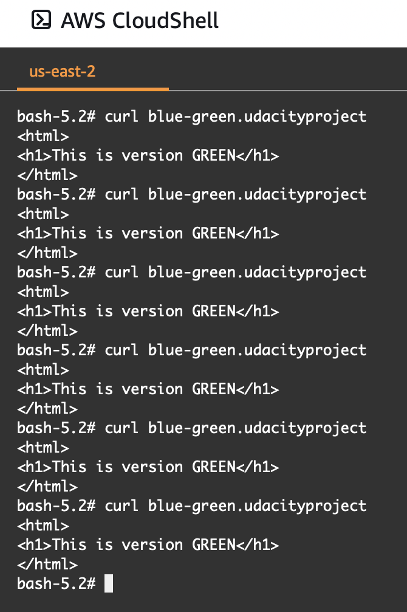

# Step 3: Blue-Green Deployments
- Shell script `blue-green.sh` created in directory `starter/apps/blue-green`.

- Screenshot to document that green & blue services are reachable is `green-blue.png` in this directory.

- Screenshot of curl to `blue-green.udacityproject.com` following destruction of blue environment is `green-only.png` in this directory.

