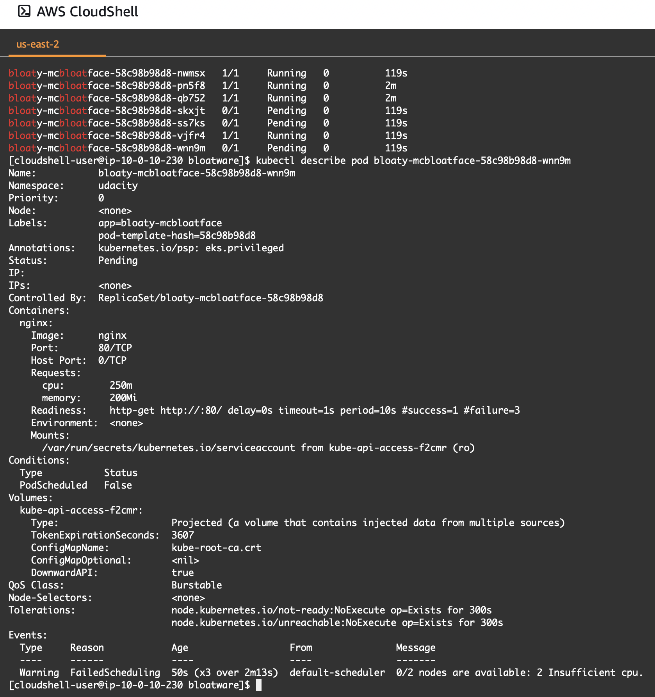
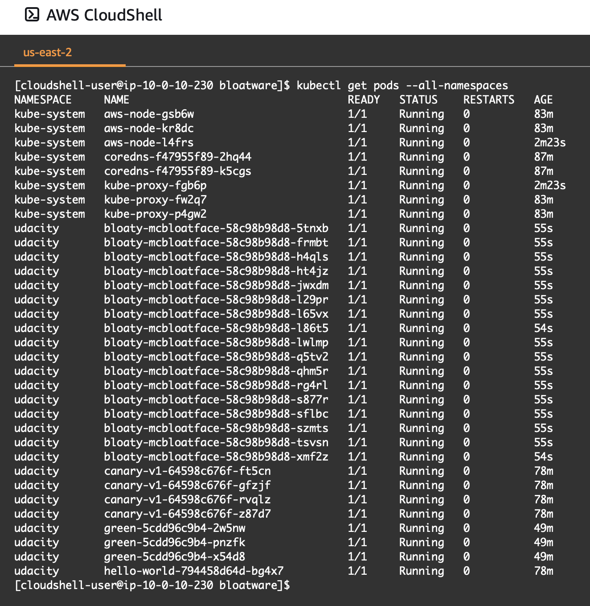
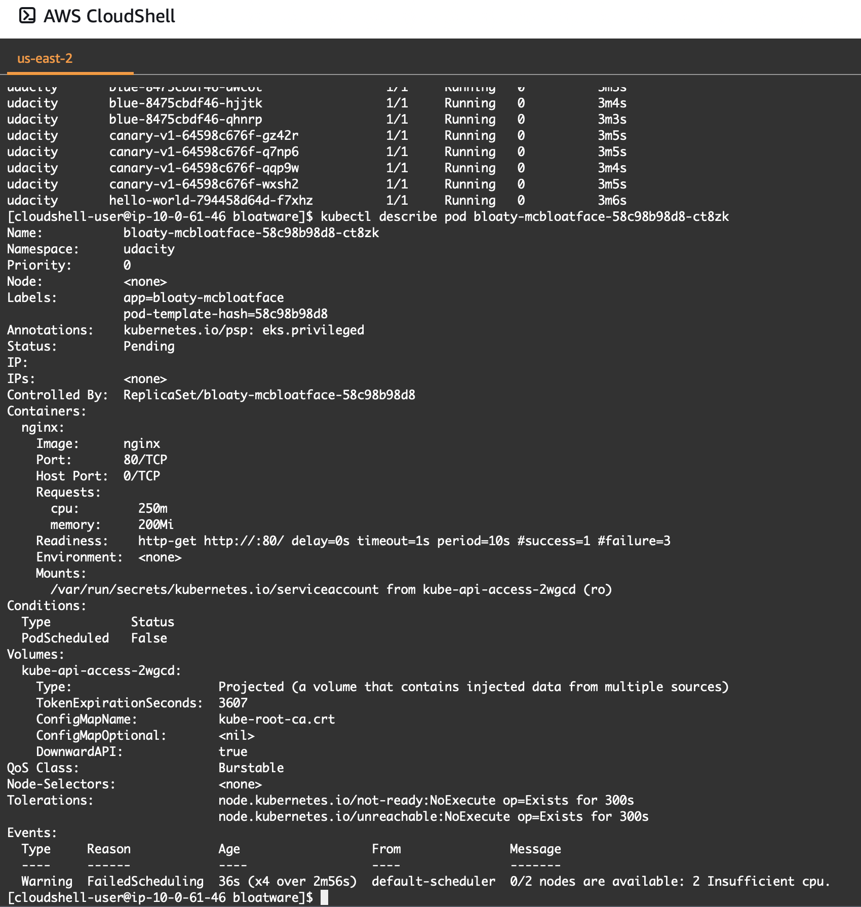
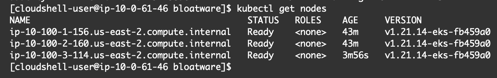
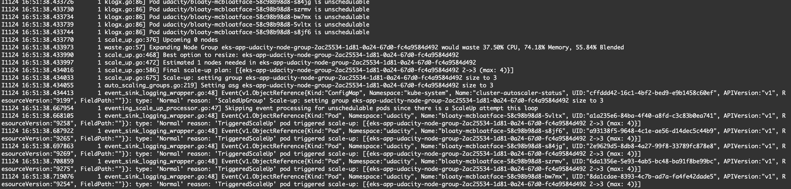

# Step 4: Node Elasticity

## Problem Diagnosis
- The apps/bloatware microservice was deployed and found not to be successful as serveral pods were stuck in the `pending` state.
- `kubectl describe pod` revealed the cause to be insufficient CPU - this can be seen in the screenshot `bloatware_fail_insufficient_cpu.png`:



- The EKS cluster was initially configured to have 2 (desired) nodes of t3.medium EC2 instance type. This type has 2 vCPU available [1], meaning that approximately 4 vCPU would have been available on the cluster. The `bloaty-mcbloatface` deployment specified 17 replicas each with `cpu: "250m"` which corresponds to a demand of 4.25 vCPU, which is greater than the total vCPU available and therefore consistent with seeing pods failing to run due to insufficient CPU.

## Manual Fix
- A manual fix was applied by increasing the desired and maximum node size settings on the cluster to 3 in file `eks.tf`, thereby increasing capacity to 6 vCPU. Reapplying the deployment was successful as can be seen in the screenshot `manual-fix.png`:



- The manual change to `eks.tf` was subsequently reverted in order to recreate the problem in readiness for implementing a robust elastic fix. This can be seen in screenshot `bloatware_issue_recreated.png`



## Automated Fix (No Human Intervention Required)
- In order to automate the scaling of the number of nodes in response to pod demand, a cluster autoscaler was created using the [cluster_autoscale.yml](https://github.com/udacity/nd087-c3-self-healing-architectures-exercises/blob/master/lesson-3-cloud-automation/exercises/starter/exercise-3/cluster_autoscale.yml) manifest from lesson 3. This was copied to the `starter/infra` directory in this repo.
- The steps to create the autoscaler were as follows:
    1. Increase maximum node size setting to 4 in `eks.tf` and apply via Terraform
    2. Setup an IAM Open ID Connect (OIDC) provider: `eksctl utils associate-iam-oidc-provider --cluster udacity-cluster --approve --region=us-east-2`
    3. Create a cluster service account with IAM permissions
    ```
    eksctl create iamserviceaccount --name cluster-autoscaler --namespace kube-system \
    --cluster udacity-cluster --attach-policy-arn "arn:aws:iam::<account_id>:policy/udacity-k8s-autoscale" \
    --approve --region us-east-2
    ```
    4. Apply cluster_autoscale.yml
- The `bloaty-mcbloatface` deployment was applied afresh and after a few minutes it was confirmed that all requested pods were running using `kubectl get pods --all-namespaces`, the output of which was stored in `node-elasticity.txt`
- The node count was verified using `kubectl get nodes` and found to have been scaled to 3 (as expected from the previous manual fix):



- The autoscaler logs were viewed using `kubectl -n kube-system logs -f deployment/cluster-autoscaler`. An extract can be seen in the screenshot below:



## References
1. https://aws.amazon.com/ec2/instance-types/  
