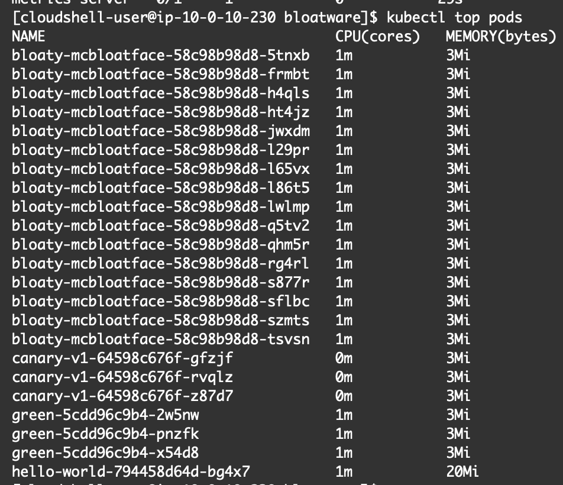
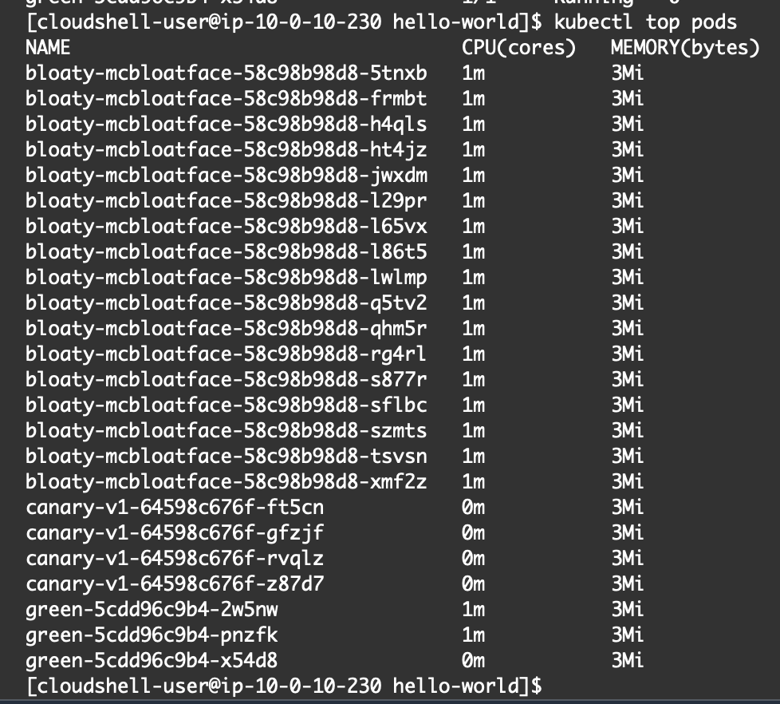

# Step 5: Observability
- To identify the service unnecessarily consuming too much memory, the following steps were carried out:
    1. Metrics server was installed on the Kubernetes cluster by following the instructions at: [https://docs.aws.amazon.com/eks/latest/userguide/metrics-server.html](https://docs.aws.amazon.com/eks/latest/userguide/metrics-server.html)
    2. The service using up the most memory was identified using the command `kubectl top pods`, the output of which is shown in `before.png`
    
    3. The name of the application using the most memory is documented in the text file `high_memory.txt`. This application was deleted from the cluster and the output of the metrics command post-deletion captured in the screenshot `after.png`
    

