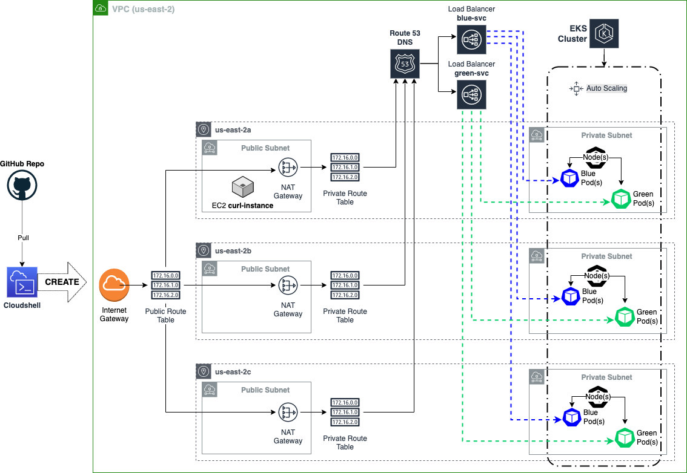

# Step 6: Diagramming the Cloud Landscape
- Diagram of the cloud landscape shown below: `deployment-roulette-architecture.png`
- The infrastructure is managed as 'Infrastructure-as-Code' (IaC) using a mixture of Terraform and Kubernetes. The code is held in GitHub.

